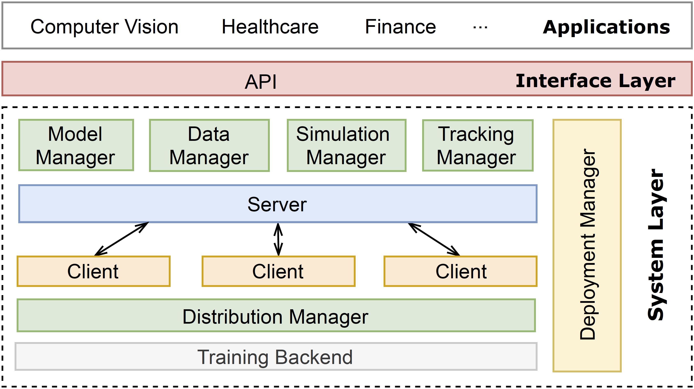

## Why EasyFL?

**EasyFL** is an easy-to-use federated learning platform that aims to enable users with various levels of expertise to experiment and prototype FL applications with little/no coding. 

You can use it for:
* FL Research on algorithm and system
* Proof-of-concept (POC) of new FL applications
* Prototype of industrial applications
* Learning FL implementations

We currently focus on horizontal FL, supporting both cross-silo and cross-device FL. You can learn more about federated learning from these [resources](https://github.com/weimingwill/awesome-federated-learning#blogs). 

### Major Features

**Easy to Start**

EasyFL is easy to install and easy to learn. It does not have complex dependency requirements. You can run EasyFL on your personal computer with only three lines of code ([Quick Start](quick_run.md)).

**Out-of-the-box Functionalities**

EasyFL provides many out-of-the-box functionalities, including datasets, models, and FL algorithms. With simple configurations, you simulate different FL scenarios using the popular datasets. We support both statistical heterogeneity simulation and system heterogeneity simulation.

**Flexible, Customizable, and Reproducible**

EasyFL is flexible to be customized according to your needs. You can easily migrate existing CV or NLP applications into the federated manner by writing the PyTorch codes that you are most familiar with. 

**Multiple Training Modes**

EasyFL supports **standalone training**, **distributed training**, and **remote training**. By developing the code once, you can easily speed up FL training with distributed training on multiple GPUs. Besides, you can even deploy it to Kubernetes with Docker using remote training.

We have developed many applications and published several [papers](projects.md) in top-tier conferences and journals using EasyFL. We believe that EasyFL will empower you with FL research and development.

## Architecture Overview

Here we introduce the architecture of EasyFL. You can jump directly to [Get Started](get_started.md) without knowing these details.

EasyFL's architecture comprises of an **interface layer** and a modularized **system layer**. The interface layer provides simple APIs for high-level applications and the system layer has complex implementations to accelerate training and shorten deployment time with out-of-the-box functionalities.

**Interface Layer**: The interface layer provides a common interface across FL applications. It contains APIs that are designed to encapsulate complex system implementations from users. These APIs decouple application-specific models, datasets, and algorithms such that EasyFL is generic to support a wide range of applications like computer vision and healthcare.
 
**System Layer**: The system layer supports and manages the FL life cycle. It consists of eight modules to support FL training pipeline and life cycle: 
1. The simulation manager initializes the experimental environment with heterogeneous simulations. 
2. The data manager loads training and testing datasets, and the model manager loads the model. 
3. A server and the clients start training and testing with FL algorithms such as FedAvg. 
4. The distribution manager optimizes the training speed of distributed training. 
5. The tracking manager collects the evaluation metrics and provides methods to query training results. 
6. The deployment manager seamlessly deploys FL and scales FL applications in production.

To learn more about EasyFL, you can check out our [paper](https://arxiv.org/abs/2105.07603).
